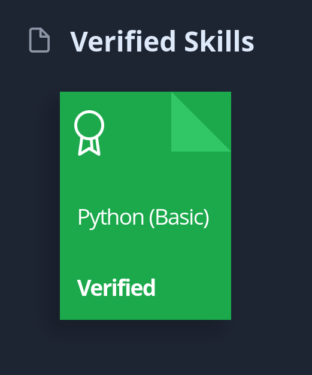

  

 
    
 
      
<b>Profile Views</b>

      
    

    

        
        
    

  

    * 👨‍💻 I'm Akbar👋, currently an Information Technology student and attending the 5th Semester.   
    * 💯 I'm currently working as an Application Support Engineer at <a href="https://eigen.az/">Eigen LTD</a>   
    * 🌳 I’m currently learning Kubernetes , Jenkins  and Cloud technologies  .   
    * 🌊 2023 Goals: <s>Improving Backend Engineering(✅)</s> and Learning Machine Learning and <s>creating an Open Source Project(✅)</s>.   
    * 🔧 Open Source Project(✅): <a href="https://github.com/EkberHasanov/translategram">Translategram</a>   
    * 🔧 Improving Backend Engineering(✅): <a href="https://github.com/EkberHasanov/PdfToMp3">Pdf2Mp3 service</a>   
    * ♟️ Interest: Math, Chess, Science, and Coding.   
    * Reach me: <a href="https://github.com/EkberHasanov">https://github.com/EkberHasanov</a>, <a href="https://gmail.com">hasanvakbar@gmail.com</a>, 
    <a href="https://www.chess.com/member/rodimeniya">Rodimeniya</a>
  

<h2 align="center" style="font-size: 32px;">Languages and Tools:</h2>

  

  
  
  
  
  
  
  
  
  
  
  
  
     
  

  

    

    <h2 align="center" style="font-size: 32px;">Planning to Learn:</h2>
      
      
      
      
Svelte|Tensorflow|NodeJS|Firebase

    

    

    <h2 align="center" style="font-size: 32px;">Actively Learning :</h2>
      
      
Solidity|Kubernetes|Jenkins|Gitlab

<!--        -->
    

  

<h1 align="center" style="font-size: 32px;"></h1>
<h2 align="center" style="font-size: 32px;"> GitHub Stats </h2>
   
   

